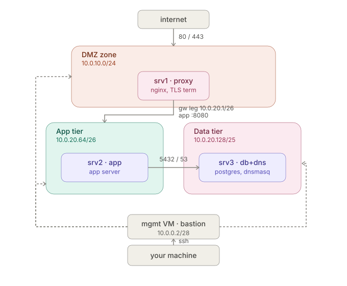

## Network Diagram:

- this design follows simple rule: nothing should be reachable only if it strictly need to be. so if a server is compromised the "blast radius" is small. unlike a flat design where everything could be exposed.

- The proxy (srv1) is the only thing that has to be reachable from the internet. it is the most attacked surface. Putting it in the DMZ zone means if its compromised the attacker has no direct route to the app logic and database.

- srv2 and srv3 hold the actual logic and the actual data they're the assets worth protecting. they are not meant to face risks niether has any reason to face the internet directly.

- Role ranges (gateway/app/data) are described explicitly as firewall-scoping boundaries, not routing boundaries. The internal zone is one /24 subnet (10.0.20.0/24), not three separate subnets.

- Your machine reaches only the mgmt VM; the mgmt VM is the sole thing with SSH access into srv1/srv2/srv3. This narrows the attack surface to one machine instead of many. It also creates a single, consistent point of audit.

## Subnet layout

| Subnet | Role | Range | Notes |
|---|---|---|---|
| DMZ | Edge tier | 10.0.10.0/24 | srv1's DMZ leg |
| Internal zone | Gateway + app tier + data tier + management | 10.0.20.0/24 | Single shared subnet — all hosts use /24; role separation enforced by firewall, not by subnet mask |

## Role ranges within the internal zone (firewall-scoping only, not routing)

| Role range | Range | Host | Notes |
|---|---|---|---|
| Gateway | 10.0.20.0/28 | srv1 internal leg (10.0.20.1) | Excluded from app/data-tier firewall rules — bridges zones, doesn't inherit tier access |
| Management | 10.0.20.16/28 | srv1 internal leg (10.0.20.1) | Excluded from app/data-tier firewall rules — bridges zones, doesn't inherit tier access |
| App tier | 10.0.20.64/26 | srv2 (`10.0.20.65) | Room for additional app servers, .66–.126 |
| Data tier | 10.0.20.128/25 | srv3 (10.0.20.129) | Room for future replicas, .131–.254 |

**Note:** every host in the internal zone is configured with the full 10.0.20.0/24 mask on its interface — the role ranges above exist only as the CIDR blocks nftables rules match against (e.g. "accept 5432 from 10.0.20.64/26"), not as separate routed subnets.

**Why one shared subnet with role-scoped firewall ranges:**

The internal zone (10.0.20.0/24) is one shared subnet srv1's internal leg, the app tier, and the data tier all use the same /24 mask, rather than each getting a separate subnet carved out of that space.

This is deliberate: subnetting controls routing, firewall rules control access — and splitting one physical network segment into different subnet masks doesn't create a real access boundary, it just makes hosts wrongly assume a router sits between ranges that are actually directly reachable. Giving every host the same /24 mask lets Linux's connected-route logic handle reachability automatically, with no manual routes needed between srv1, srv2, and srv3.

The role ranges (10.0.20.0/28 gateway, 10.0.20.16/28 management, 10.0.20.64/26 app tier, 10.0.20.128/25 data tier) still exist, but only as the ranges firewall rules match against e.g. "accept port 5432 only from 10.0.20.64/26." Access control lives entirely in the firewall, not the addressing. This keeps the earlier scaling benefit intact: a new app-tier host just needs an IP inside its range, no new subnets or routes required.

**IP scheme:**

| server | zone |IP|
| ----------- | ----------- | ----------- |
|srv1| DMZ leg|10.0.10.10|
|srv1| gateway/transit |10.0.20.1|
|srv2| App tier|10.0.20.65|
|srv3|Data tier|10.0.20.129|
|admin host| Managment|10.0.20.17|

**clarification:**

- srv1 act as router, not just a proxy: srv2/srv3's default route points at srv1's internal IP: 10.0.20.1, IP forwording is enabled and a masquerade/NAT rule was added so traffic from the internal zone gets translated to srv1's NAT adapter address on its way out

- Since the NAT adapter is what VirtualBox actually uses to simulate "the internet" (what is used in this project.), inbound public traffic physically arrives on the NAT interface, not the DMZ leg.

- The DMZ leg currently has only srv1 on it, no other host exists in that segment. So right now it's a trust-boundary placeholder: it exists to represent "this is where DMZ-tier hosts would live".

## DNS

**Setup:**

Internal DNS resolution is provided by dnsmasq, running on srv3 (db.lab.internal, 10.0.20.129), serving only the internal zone (10.0.20.0/24).

Each host in the fleet resolves by name rather than hardcoded IP:

| Hostname | IP |
| ----------- | ----------- |
|proxy.lab.internal|10.0.20.1|
|app.lab.internal|10.0.20.65|
|db.lab.internal|10.0.20.129|

- Static host mappings are defined in dnsmasq.d/lab.conf and dnsmasq is bound explicitly to the internal interface (bind-interfaces), so it does not answer queries from the DMZ leg or the NAT-facing adapter.

- Upstream forwarding is disabled dnsmasq answers only for lab.internal and does not resolve external domains, since nothing on the internal zone should need to reach the public internet directly.

- Each internal host's /etc/netplan config points its nameservers entry at 10.0.20.129, so name resolution is automatic on boot rather than requiring manual /etc/hosts edits per server.

**Why dnsmasq:**

dnsmasq was chosen over a full DNS server (BIND9) or static /etc/hosts files for three reasons:

- Right-sized for the fleet
- Avoids the maintenance problem of static hosts files
- It's the same tool that would handle DHCP if the fleet grew

**Why it doesn't forward external queries:**

Disabling upstream forwarding is a deliberate security choice. hosts on the internal zone have no legitimate reason to resolve public domains, since they never initiate outbound connections to the internet by design (only srv1's DMZ leg faces the internet).

**Why both TCP and UDP, not just one**

UDP 53 is the default and by far the most common case. nearly every DNS query and response fits in a single UDP packet. TCP 53 is the fallback DNS uses automatically when a response is too large for a single UDP packet.

## Firewall

Each server runs its own host-based firewall (nftables). Rules are scoped to the narrowest source that's appropriate for that path: a single trusted host where the source is a fixed, non-interchangeable role (e.g. the proxy), and a subnet where the source is a scalable tier of interchangeable hosts (e.g. the app tier). Every chain ends in a default-deny policy only what's explicitly listed below is reachable.

### srv1 (proxy / NAT gateway)

| Direction | Source | Destination | Port | Proto | Rule |
| ------ | ------ |------ |------ |------ |------ |
|Inbound|Internet (any)|srv1 DMZ leg|80, 443|TCP|Allow|
|Inbound|Management|	srv1 internal leg|2307|TCP|Allow|
|Inbound|Anything else|srv1 (any interface)|-|-|Deny (default)|
|Forward|App tier + Data tier|Internet (via NAT)|80, 443|TCP|Allow|
|Forward|Anything else|Internet|-|-|Deny (default)|

NAT masquerade applied on the internet-facing interface for the allowed forward path only.

### srv2 (app tier)

| Direction | Source | Destination | Port | Proto | Rule |
|---|---|---|---|---|---|
| Inbound | Management | srv2 | 22 | TCP | Allow |
| Inbound | srv1 (proxy IP only) | srv2 | 8080 | TCP | Allow |
| Inbound | Anything else | srv2 | - | - | Deny (default) |
| Outbound | srv2 | Data tier | 5432 | TCP | Allow |
| Outbound | srv2 | Data tier | 53 | TCP + UDP | Allow |
| Outbound | srv2 | Internet | 80, 443 | TCP | Allow |
| Outbound | srv2 | Anything else | - | - | Deny (default) |

### srv3 (data tier, database + DNS)

| Direction | Source | Destination | Port | Proto | Rule |
|---|---|---|---|---|---|
| Inbound | Management | srv3 | 22 | TCP | Allow |
| Inbound | App tier | srv3 | 5432 | TCP | Allow |
| Inbound | App tier | srv3 | 53 | TCP + UDP | Allow |
| Inbound | srv1 (gateway IP only) | srv3 | 53 | TCP + UDP | Allow |
| Inbound | Anything else | srv3 | - | - | Deny (default) |
| Outbound | srv3 | Anything | - | - | Deny (default - no outbound need; DNS forwarding disabled) |

**Explicit denies**

These are consequences of the default-deny policy, not separate rules, but are called out here because they're the properties the whole design exists to guarantee:

 - DMZ → Data tier is never permitted, at any port. srv1's internal leg is deliberately excluded from the app-tier subnet range so it cannot inherit the subnet-wide database rule; its only permitted path to srv3 is the narrow DNS-only rule above.

  - App tier → DMZ inbound is never permitted. srv2 has no rule allowing connections initiated toward srv1's DMZ leg.

  - Data tier has no outbound path. srv3 never initiates connections it only answers on the ports explicitly allowed inbound.

 - Nothing outside the management subnet can reach SSH on any host, including the DMZ leg — SSH is only listened for on internal-facing interfaces.

**Design principle**

Rules scoped to a single IP (srv1 → srv2) represent a fixed, specifically-trusted host that should never gain broader access just by sharing a range with a scalable tier. Rules scoped to a range (app tier → data tier) represent a tier of interchangeable hosts, where adding a new member should require no firewall changes anywhere else in the fleet. Any host acting as a gateway between zones (srv1) is addressed outside both tiers it bridges, specifically so it cannot silently inherit tier-wide permissions it wasn't designed to have.

