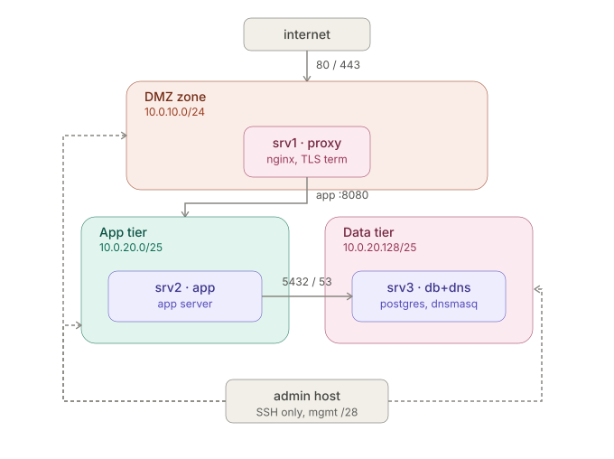

## Network Diagram:

### Why:

- this design follows simple rule: nothing should be reachable only if it strictly need to be. so if a server is compromised the "blast radius" is small. unlike a flat design where everything could be exposed.

- The proxy (srv1) is the only thing that has to be reachable from the internet. it is the most attacked surface. Putting it in the DMZ zone means if its compromised the attacker has no direct route to the app logic and database.

- srv2 and srv3 hold the actual logic and the actual data they're the assets worth protecting. they are not meant to face risks niether has any reason to face the internet directly.

- role based subnet layout for scalability.

## Subnet layout

| Subnet | Role |Range| Purpose |
| ----------- | ----------- | ----------- |----------- |
|Managment|Admin Access|10.0.0.0/28|SSH access from the operator's host only|
|DMZ|Edge tier|10.0.10.0/24|Internet-facing leg of the proxy; room for future edge devices|
|Gateway/transit|srv1 internal leg|10.0.20.0/26|a gateway or cross-tier roles. .0–.63|
|APP tier|Application servers|10.0.20.64/26|Application server(s); usable range .64–.127|
|Data tier|Databases + DNS|10.0.20.128/25|Database and internal DNS resolver; usable range .129–.254|

**Why role-based subnetting:**

- The core reasoning is that a firewall rule scoped to a role rather than an individual host doesn't need to change when the fleet grows.

- access is granted to a role/tag, and any host that is a member of that role automatically inherits the access, rather than every new host requiring manual firewall edits.

- Any host that plays a gateway or cross-tier role should live outside the tiers it routes between otherwise it silently inherits every permission granted to whichever tier it happens to share an address range with, even permissions it was explicitly designed not to have.

**Alternatives:**

- one flat subnet for every internal server, was rejected: No natural boundary for firewall rules. every rule has to be written per-host, and every new server means a new rule on every other server it needs to reach. This doesn't scale and is easy to get wrong or forget.

- a single subnet per physical server rather than per role (e.g. 10.0.20.0/30 per box). it optimizes for address while making the same scaling problem worse: adding a new role or a new tier would require re-carving the address space rather than simply drawing from an already-reserved block.

**IP scheme:**

| server | zone |IP|
| ----------- | ----------- | ----------- |
|srv1| DMZ leg|10.0.10.10|
|srv1| gateway/transit |10.0.20.1|
|srv2| App tier|10.0.20.65|
|srv3|Data tier|10.0.20.129|
|admin host| Managment|10.0.0.2|

**clarification:**

- srv1 act as router, not just a proxy: srv2/srv3's default route points at srv1's internal IP: 10.0.20.1, IP forwording is enabled and a masquerade/NAT rule was added so traffic from the internal zone gets translated to srv1's NAT adapter address on its way out

- Since the NAT adapter is what VirtualBox actually uses to simulate "the internet" (what is used in this project.), inbound public traffic physically arrives on the NAT interface, not the DMZ leg.

- The DMZ leg currently has only srv1 on it, no other host exists in that segment. So right now it's a trust-boundary placeholder: it exists to represent "this is where DMZ-tier hosts would live".

## DNS

**Setup:**

Internal DNS resolution is provided by dnsmasq, running on srv3 (db.lab.internal, 10.0.20.129), serving only the internal zone (10.0.20.0/24).

Each host in the fleet resolves by name rather than hardcoded IP:

| Hostname | IP |
| ----------- | ----------- |
|proxy.lab.internal|10.0.20.1|
|app.lab.internal|10.0.20.65|
|db.lab.internal|10.0.20.129|

- Static host mappings are defined in dnsmasq.d/lab.conf and dnsmasq is bound explicitly to the internal interface (bind-interfaces), so it does not answer queries from the DMZ leg or the NAT-facing adapter.

- Upstream forwarding is disabled dnsmasq answers only for lab.internal and does not resolve external domains, since nothing on the internal zone should need to reach the public internet directly.

- Each internal host's /etc/netplan config points its nameservers entry at 10.0.20.129, so name resolution is automatic on boot rather than requiring manual /etc/hosts edits per server.

**Why dnsmasq:**

dnsmasq was chosen over a full DNS server (BIND9) or static /etc/hosts files for three reasons:

- Right-sized for the fleet
- Avoids the maintenance problem of static hosts files
- It's the same tool that would handle DHCP if the fleet grew

**Why it doesn't forward external queries:**

Disabling upstream forwarding is a deliberate security choice. hosts on the internal zone have no legitimate reason to resolve public domains, since they never initiate outbound connections to the internet by design (only srv1's DMZ leg faces the internet).

## Firewall

Each server runs its own host-based firewall (nftables). Rules are scoped to the narrowest source that's appropriate for that path: a single trusted host where the source is a fixed, non-interchangeable role (e.g. the proxy), and a subnet where the source is a scalable tier of interchangeable hosts (e.g. the app tier). Every chain ends in a default-deny policy only what's explicitly listed below is reachable.

### srv1 (proxy / NAT gateway)

| Direction | Source | Destination | Port | Proto | Rule |
| ------ | ------ |------ |------ |------ |------ |
|Inbound|Internet (any)|srv1 DMZ leg|80, 443|TCP|Allow|
|Inbound|Management subnet|	srv1 internal leg|2307|TCP|Allow|
|Inbound|Anything else|srv1 (any interface)|-|-|Deny (default)|
|Forward|App tier + Data tier|Internet (via NAT)|80, 443|TCP|Allow|
|Forward|Anything else|Internet|-|-|Deny (default)|

NAT masquerade applied on the internet-facing interface for the allowed forward path only.

### srv2 (app tier)

| Direction | Source | Destination | Port | Proto | Rule |
|---|---|---|---|---|---|
| Inbound | Management subnet | srv2 | 22 | TCP | Allow |
| Inbound | srv1 (proxy IP only) | srv2 | 8080 | TCP | Allow |
| Inbound | Anything else | srv2 | - | - | Deny (default) |
| Outbound | srv2 | Data tier subnet | 5432 | TCP | Allow |
| Outbound | srv2 | Data tier subnet | 53 | TCP + UDP | Allow |
| Outbound | srv2 | Internet | 80, 443 | TCP | Allow |
| Outbound | srv2 | Anything else | - | - | Deny (default) |

### srv3 (data tier, database + DNS)

| Direction | Source | Destination | Port | Proto | Rule |
|---|---|---|---|---|---|
| Inbound | Management subnet | srv3 | 22 | TCP | Allow |
| Inbound | App tier subnet | srv3 | 5432 | TCP | Allow |
| Inbound | App tier subnet | srv3 | 53 | TCP + UDP | Allow |
| Inbound | srv1 (gateway IP only) | srv3 | 53 | TCP + UDP | Allow |
| Inbound | Anything else | srv3 | - | - | Deny (default) |
| Outbound | srv3 | Anything | - | - | Deny (default - no outbound need; DNS forwarding disabled) |
